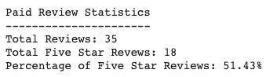
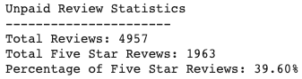

# Amazon_Vine_Analysis

## Purpose

Amazon Vine members are provided products to review by companies who pay a small fee to Amazon.

This project analyzes Amazon Reviews on the Major Appliance dataset to determine if there are any bias towards favourable reviews from Vine members in the dataset.
The analysis will focus on 
* Reviews that have greater than 20 total votes and deemed helpful (50% of the total votes must have been marked as helpful). 
* Total amount and percentage of 5 star reviews split by paid and unpaid reviews. 

Dataset Analyzed: https://s3.amazonaws.com/amazon-reviews-pds/tsv/amazon_reviews_us_Major_Appliances_v1_00.tsv.gz

## Results
The results for paid reviews are as follows:

The results for unpaid reviews are as follows:

### How many Vine reviews and non-Vine reviews were there?
There were 35 Vine reviews and 4957 non-Vine reviews.

### How many Vine reviews were 5 stars? How many non-Vine reviews were 5 stars?
There were 18 5-star Vine Reviews and 1963 5-star non-Vine reviews.

### What percentage of Vine reviews were 5 stars? What percentage of non-Vine reviews were 5 stars?
51.43% of Vine reviews were 5-stars. 39.60% of non-Vine reviews were 5-stars.

## Summary
Due to the percentage of 5 star reviews with respect to paid and unpaid reviews, there does seem to be a positivity bias. There is 11.77% difference between the two values. 

Additional analysis could be performed based off of product IDs:
1. Add the product_id column to the initial dataframe.
2. Perform the analysis up until the dataframe is split to paid/unpaid reviews.
3. Perform an inner join on the two datasets. This should remove all products where there are only Vine reviews or where there are only non-Vine reviews. Therefore all products in this new dataframe should have both types of reviews.
4. Split this new dataframe up to paid/unpaid reviews.
5. Calculate the total and percentage of 5-Star Reviews for the new paid and unpaid review dataframes.